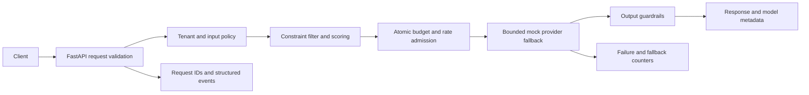

# AI Platform Control Plane

A runnable inference control plane for deciding **which model may serve a request,
what capacity it may consume, and how failures are handled**. All adapters are
synthetic; no paid account, model download, or API key is required.

Routing is easy until regional policy, cost ceilings, tenant capacity and provider
failures must hold at the same time. This implementation keeps policy decisions
separate from provider execution and tests the boundaries through an HTTP API.

## Architecture



- `config.py` validates server-owned policies and model metadata; override defaults
  with `AI_PLATFORM_CONFIG` pointing to a JSON file.
- `policy.py` filters region, capabilities, blocked models and cost ceilings before
  quality/latency/cost/reliability scoring in `routing.py`.
- `budget.py` atomically reserves the UTF-8 input byte count plus maximum output
  units for **every eligible fallback attempt**. Reservations remain consumed even
  after failure. This favors a hard conservative bound over utilization.
- `providers.py` defines the asynchronous adapter contract. Timeouts and explicitly
  transient errors trigger fallback; consecutive failures open a cooldown circuit.
- `guardrails.py` blocks simple secret/injection indicators and redacts basic PII.
  These heuristics are demonstrative and are not a security boundary.
- `evals.py` offers an offline lexical regression signal. It is not a semantic
  quality evaluator and does not automatically retune routing.

## Run and test

Python 3.11–3.13:

```bash
python -m venv .venv
# Activate: Windows .venv\Scripts\Activate.ps1; POSIX source .venv/bin/activate
python -m pip install -r requirements-dev.lock.txt
python -m pip install -e . --no-deps
python -m pytest -q
python demo.py
python -m uvicorn ai_platform.app:app --host 127.0.0.1 --log-config src/ai_platform/logging.json
```

Open [local API documentation](http://127.0.0.1:8000/docs). POST `/v1/infer`:

```json
{"tenant":"demo","region":"us","prompt":"Summarize a synthetic system.","max_output_tokens":32}
```

Responses include a generated request ID, selected model, ranked attempt history,
routing reason, reported usage and remaining reserved capacity. The client cannot
supply a token estimate to evade admission checks.

Tests cover HTTP validation, tenant denial, budget/rate rejection, concurrent
reservations, timeout fallback, output filtering and circuit cooldown behavior.
CI runs tests, formatting, lint and the demo on three Python versions.

## Failure and operational behavior

| Condition | Behavior |
| --- | --- |
| Unknown tenant, forbidden region/capability | 403 before admission |
| Guardrail rejection | 400 before admission |
| Rate or budget exhausted | 429; no provider call |
| No eligible model or every attempt fails | 503 |
| Unsafe provider response | 502; reservation retained |
| Configuration invalid | Startup fails |
| Process restart | Local counters, circuits and budgets reset |

JSON events include request IDs, provider identity, duration and outcome, never
prompt or response text. `/metrics` returns process-local JSON counters (not
Prometheus exposition). Health endpoints report process/config readiness, not
upstream model availability. A cooldown makes a failed provider eligible again;
a distributed half-open probe lease is deliberately not implemented.

## Deployment boundary and evolution

**This is a local, unauthenticated mock sandbox.** Tenant labels are trusted only
for demonstrations; callers can impersonate labels. Do not expose it publicly or
connect billable adapters before adding authenticated identity, durable atomic
admission, real tokenizer/usage reconciliation and provider-specific cancellation.

`docker build -t ai-platform-control-plane:local .` builds a non-root image.
Run it with `docker run --rm -p 127.0.0.1:8000:8000 ai-platform-control-plane:local`.
The Kubernetes sandbox uses one replica and one worker:
`kubectl apply -f k8s/deployment.yaml -f k8s/network-policy.yaml`.
Load the image into your local cluster first. HPA and PDB files are **future design
examples**; do not apply them to the local ledger. Container/cluster execution
requires Docker/Kubernetes and is not implied by unit-test success.

Next production steps: transactional shared budgets with reset periods, authenticated
tenant resolution, a durable inference audit, exporter-backed telemetry and measured
model evaluations. Scoring currently uses synthetic static metadata, not live SLOs.
See [decisions](docs/ADR-002-admission-and-resilience.md) and [runbook](docs/runbook.md).

Independent clean-room implementation using synthetic data and generic architecture
patterns; no employer source, configuration, architecture or confidential artifacts.
